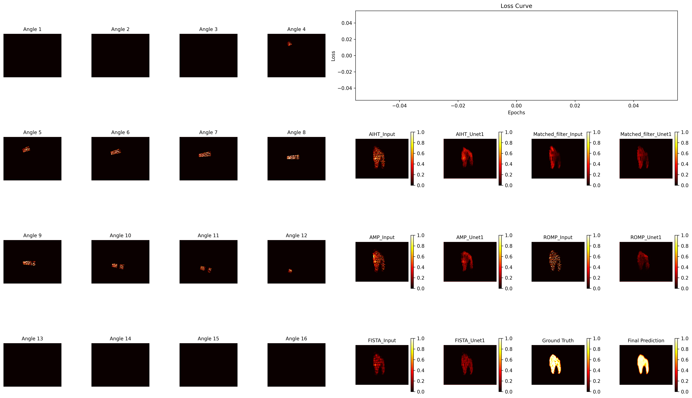

# 🌐 Beam-Steering Learning Method

This repository provides the **deep learning module** for imaging result refinement in the academic paper submitted to *IEEE Journal of Selected Topics in Electromagnetics, Antennas and Propagation (JSETAP)*. The approach leverages **U-Net** for enhancing coarse imaging results generated by **Inverse Scattering Problem (ISPs)** methods.

---

## 📄 Paper

> 🔍 The code corresponds to the deep learning component of our JSETAP submission.  
> As shown in the figure below, the proposed two-stage architecture integrates:  
> - A **local-to-global U-Net**, which stitches beam-scanned local views into a coarse global image (Fig. d), and
> - A **fusion U-Net**, which combines different ISP methods’ global reconstructions to produce the final output (Fig. e).

📌 **Method Overview Figure**:  
<p align="center">
  
</p>

---

## 👨‍💻 Authors

- **Wen Lue** – [luewen@u.nus.edu](mailto:luewen@u.nus.edu)  
- Zhao Siyuan  
- Yin Tiantian  
- Guo Yongxin  
- Chen Xudong  

---

## 🧠 U-Net Architecture

The U-Net model applied in this work is based on the original design proposed in:

> 📖 [U-Net: Convolutional Networks for Biomedical Image Segmentation](https://arxiv.org/abs/1505.04597)  
> *Olaf Ronneberger, Philipp Fischer, Thomas Brox*

---

## 🛠 Usage

This repository provides pre-configured training scripts for the two-stage U-Net refinement.

```bash
python main.py
```

This will launch training on 12 example samples and save visualized predictions such as:

<p align="center">
  
</p>
